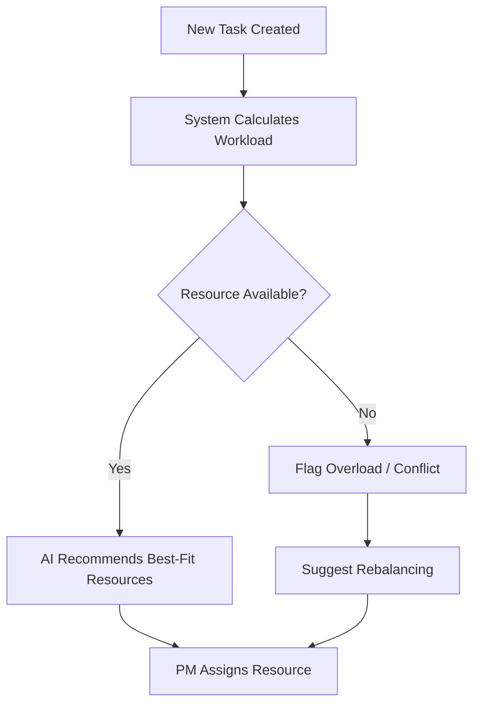
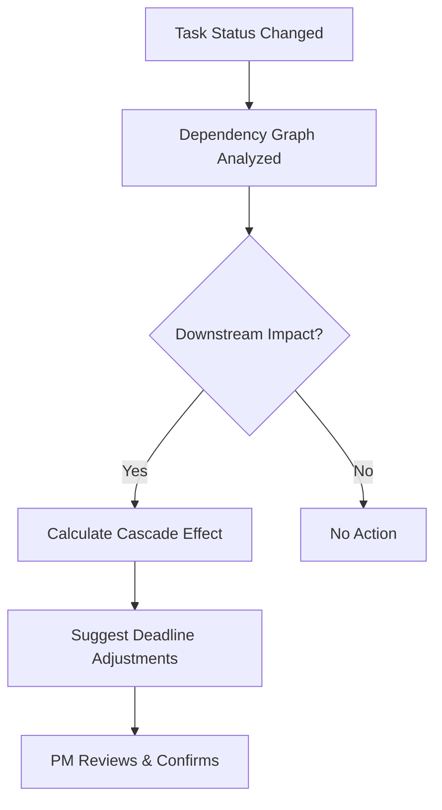
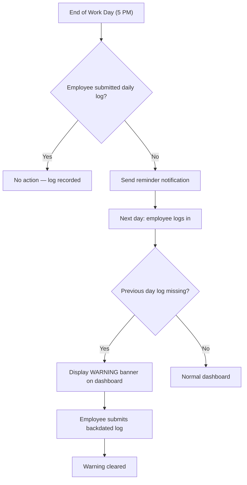
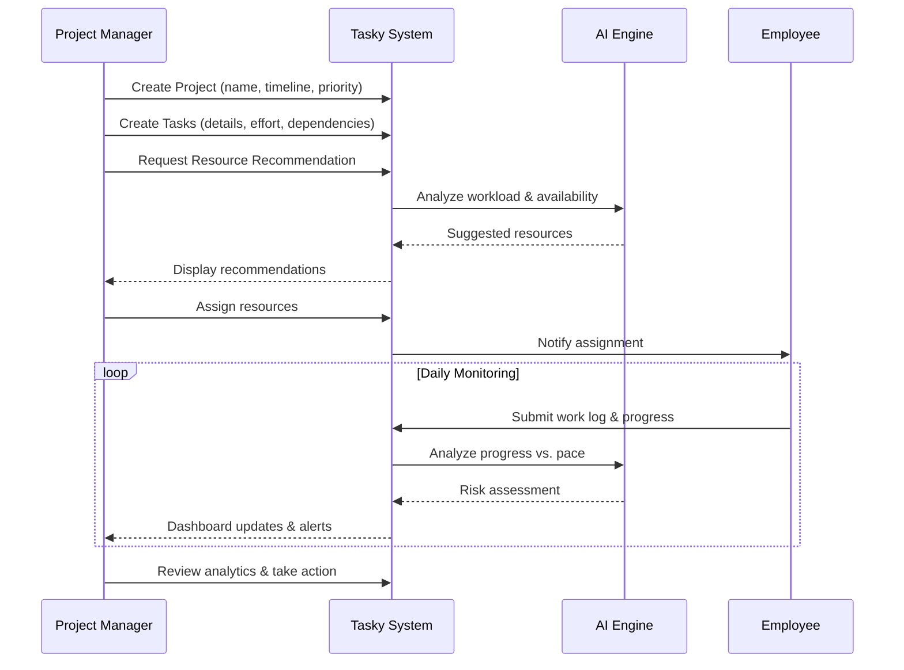
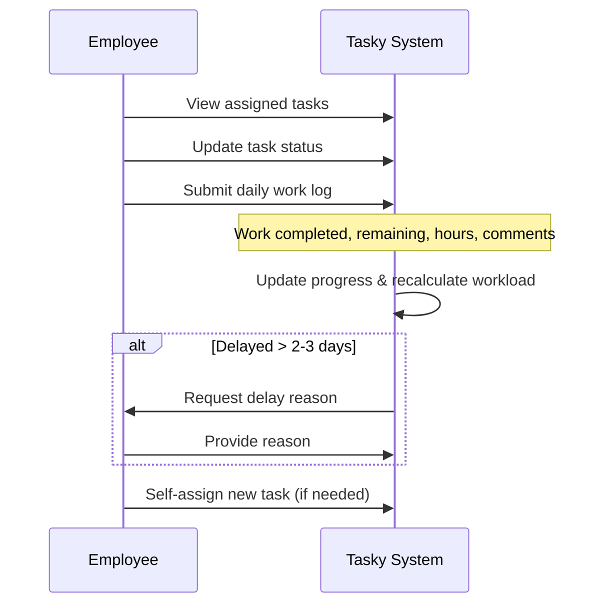
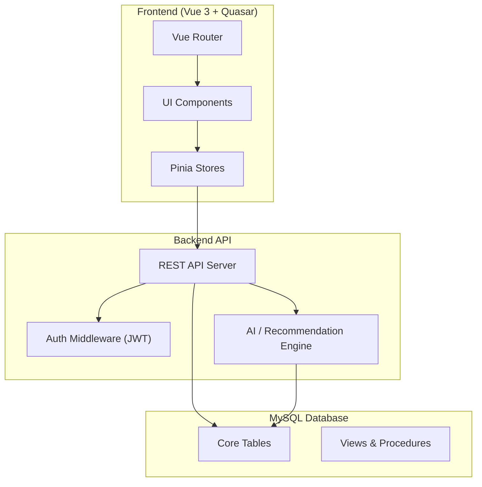
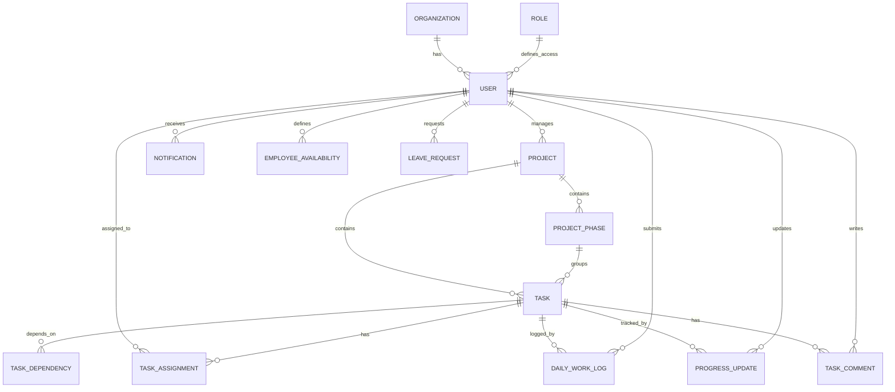

# Tasky — Smart Project Task Management & Resource Scheduling System

## Project Synopsis

---

## 1. Introduction

**Tasky** is a web-based Smart Project Task Management & Resource Scheduling System designed for organizations that manage multiple concurrent projects with shared human resources. The system addresses the critical challenges of workload balancing, dependency-aware scheduling, predictive deadline monitoring, and cross-project visibility — enabling Project Managers and Employees (Resources) to collaborate efficiently through an intelligent, AI-augmented platform.

The frontend is built using **Vue 3 + Quasar Framework** (with TypeScript and Pinia for state management), and the backend data layer is powered by **MySQL**.

---

## 2. Problem Statement

Organizations routinely struggle with:

| Challenge                        | Impact                               |
| -------------------------------- | ------------------------------------ |
| Shared resources across projects | Workload conflicts and burnout       |
| Complex task dependencies        | Cascading delays when one task slips |
| No unified progress view         | Blind spots in project health        |
| Manual scheduling                | Suboptimal resource allocation       |
| Late risk detection              | Missed deadlines and budget overruns |

Tasky solves these by providing a **centralized, intelligent platform** that automates workload analysis, dependency tracking, schedule impact analysis, and progress monitoring.

---

## 3. User Roles & Access

### 3.1 Project Manager (PM)

| Capability               | Description                                                                                                          |
| ------------------------ | -------------------------------------------------------------------------------------------------------------------- |
| Project CRUD             | Create, update, delete projects with timelines and priorities                                                        |
| Task Management          | Create multiple tasks under each project with priority, deadline, expected effort, and dependencies                  |
| Resource Assignment      | Assign one or multiple employees to a task                                                                           |
| Team Management          | Add/remove employees; create roles for sign-up                                                                       |
| Overall Project View     | View the overall status of **only the projects they manage** — task status, resource allocation, progress, deadlines |
| AI-Powered Suggestions   | Receive resource recommendations and schedule adjustments                                                            |
| PM Analytics Dashboard   | Dedicated analytics dashboard — task priority distribution, workload graphs, progress trends, risk analysis          |
| Monitor Daily Logs       | See which employees have not submitted their daily log; view warnings for non-compliance                             |
| Comments & Communication | Comment on tasks with employees                                                                                      |
| Notifications            | Receive alerts for overdue tasks, risk flags, resource conflicts, missing daily logs                                 |

### 3.2 Employee (Resource)

| Capability                   | Description                                                                                                                                                                              |
| ---------------------------- | ---------------------------------------------------------------------------------------------------------------------------------------------------------------------------------------- |
| Task View                    | View **only their own** assigned tasks across all projects                                                                                                                               |
| Workload View                | See current workload and upcoming deadlines                                                                                                                                              |
| Self-Assigned Tasks          | Create tasks when required (self-assigning)                                                                                                                                              |
| Daily Progress Updates       | At the end of each day, update progress for all tasks worked on — indicate whether task is **completed**, **partially completed**, or **still in progress** and provide relevant details |
| Work Log Submission          | Provide daily status: work completed, remaining work, hours spent, and comments                                                                                                          |
| Employee Analytics Dashboard | Dedicated analytics dashboard — personal performance, task completion rate, workload trends                                                                                              |
| Delay Reasons                | Enter reason for delay after 2-3 days of no progress                                                                                                                                     |
| Weekend/Leave Management     | Mark weekend availability, request leave                                                                                                                                                 |

> [!IMPORTANT]
> **Mandatory Daily Log Enforcement**
> Employees **must** log their entries daily. If an employee does not submit their daily work log:
>
> - A **reminder notification** is sent at the end of the work day (e.g., 5:00 PM).
> - The **next day**, a **warning** is prominently displayed on the employee's dashboard indicating missing log entries.
> - The PM dashboard also flags employees with missing daily logs.
> - Consecutive missed days escalate the warning severity.

### 3.3 Role-Based Sign-Up

- Managers can **create roles** during the sign-up/onboarding flow.
- Each employee is assigned a role (e.g., Senior Developer, QA Engineer, DevOps) which informs skill-based resource recommendations.
- Employee codes may be used for internal identification.

---

## 4. Core Feature Modules

### Feature 1 — Smart Resource & Workload Management

- **Workload Calculation**: Aggregates assigned tasks, expected effort (hours), priorities, and deadlines across all projects per resource.
- **Resource Recommendation**: AI suggests the best-fit employee for a new task based on:
  - Current availability (hours remaining in the week)
  - Skill match
  - Existing task priority conflicts
- **Overload Detection**: Flags resources exceeding capacity thresholds (e.g., >40 hrs/week).
- **Conflict Identification**: Alerts when the same resource has conflicting deadlines across projects.
- **Workload Graphs**: Clicking on a bar in the workload chart drills down to show priority-sorted task lists for that resource.

---

### Feature 2 — Intelligent Schedule & Impact Management

- **Dependency Tracking**: Maintains a DAG (Directed Acyclic Graph) of task dependencies within and across projects.
- **Impact Analysis**: When a task is delayed or completed early, the system analyzes the ripple effect on all dependent tasks.
- **Cross-Project Awareness**: Considers a resource's commitments across multiple projects before suggesting changes.
- **Schedule Suggestions**: Proposes adjusted deadlines for affected tasks, which the PM can confirm or modify.
- **Phase/Step Management**: Tasks can be organized into phases or steps within a project (as noted in discussion: "Creating phases or steps").

---

### Feature 3 — Predictive Progress & Deadline Monitoring

| Status       | Condition                                        | Visual Indicator    |
| ------------ | ------------------------------------------------ | ------------------- |
| ✅ On Track  | Progress ≥ expected pace                         | Green progress bar  |
| ⚠️ At Risk   | Progress slightly behind                         | Orange progress bar |
| 🔴 Delayed   | Progress significantly behind or deadline passed | Red progress bar    |
| ✔️ Completed | Task finished                                    | Full green bar      |

- **Daily Progress History**: Maintains a timestamped log of progress changes for every task.
- **Pace Analysis**: Compares actual progress vs. expected progress based on effort and elapsed time.
- **Early Warnings**: Surfaces "At Risk" tasks before they become "Delayed".
- **Delay Reason Tracking**: After 2-3 days of stalled progress, the system prompts the employee to enter a reason for delay.
- **Reminder System**: 15-minute reminders before deadlines.

#### Daily Log Enforcement System

- **End-of-Day Reminder**: If an employee has active tasks but hasn't logged any work by end-of-day, a reminder notification is automatically triggered.
- **Next-Day Warning**: If the log is still missing the next morning, a prominent warning banner appears on the employee's dashboard.
- **PM Visibility**: The PM dashboard highlights employees with missing daily logs so managers can follow up.
- **Compliance Tracking**: The system maintains a log compliance record per employee (logged / missed / late) for analytics.

---

### Feature 4 — Analytics & Reporting

> [!IMPORTANT]
> Analytics dashboards are available for **both Project Managers and Employees**.

#### PM Analytics Dashboard

- **Task Priority Distribution**: Visual breakdown (pie/bar chart) of tasks by priority level.
- **Sorting**: Ascending/descending sort on priority, deadline, workload.
- **Important Unassigned Tasks**: Highlights high-priority tasks that haven't been assigned.
- **Graph + Text Views**: Toggle between graphical and tabular data representations.
- **Per-Employee Drill-Down**: Click on an employee in the chart to see their individual task breakdown.
- **Toggle View**: Data ↔ Graphs toggle for all analytical views.
- **Resource Workload Overview**: Bar/heatmap charts showing each resource's utilization.
- **Daily Log Compliance**: View which employees are consistently logging vs. missing entries.
- **Project Health Summary**: Overall status of delayed, on-track, at-risk, and completed tasks.

#### Employee Analytics Dashboard

- **Personal Task Summary**: Breakdown of assigned tasks by status (completed, in-progress, not-started, blocked).
- **Workload Trend**: Line chart of weekly workload over time.
- **Completion Rate**: Percentage of tasks completed on time vs. delayed.
- **Daily Log History**: Calendar view showing days logged vs. missed with warnings.
- **Effort Analysis**: Expected vs. actual effort comparison per task.
- **Cross-Project View**: Tasks grouped by project with progress indicators.

---

### Feature 5 — Resource Scheduling & Availability

- **Work Week**: Default 5-day work week (Mon–Fri); Saturday & Sunday off.
- **Weekend Exception**: Option for employees to mark weekend availability when needed (with PM approval).
- **Leave Management**: Employees can log leave; the system factors this into workload calculations.
- **Reminders**: Automated reminders 15 minutes before task deadlines.
- **AI Suggestions**: When delays occur, the system suggests:
  - Reassign to another resource
  - Extend deadline
  - Reduce scope

---

### Feature 6 — AI-Powered Intelligence Layer

| AI Feature           | Description                                                   |
| -------------------- | ------------------------------------------------------------- |
| Resource Suggestions | Recommends best-fit employees for new tasks                   |
| Schedule Adjustments | Suggests deadline changes when dependencies shift             |
| Risk Prediction      | Identifies tasks at risk of missing deadlines                 |
| Delay Analysis       | Analyzes delay patterns and suggests mitigations              |
| Task Details         | AI-generated task descriptions and detail enrichment          |
| Don't Classify       | Option to override AI categorization when it's not applicable |

---

### Feature 7 — Communication & Collaboration

- **Task Comments**: PM and employees can exchange comments on tasks.
- **Sticky Notes**: Quick notes that can be attached to tasks or project boards.
- **Notifications**: System-generated notifications for:
  - Task assignments
  - Status changes
  - Approaching deadlines
  - Risk alerts
  - AI suggestions requiring confirmation
  - **Daily log reminders** (end-of-day if not yet submitted)
  - **Daily log warnings** (next-day if still missing)

---

## 5. Application Pages & Navigation

Based on the current codebase and discussion notes:

| Page               | Route                 | Role     | Purpose                                                                                            |
| ------------------ | --------------------- | -------- | -------------------------------------------------------------------------------------------------- |
| PM Dashboard       | `/dashboard`          | Manager  | Overall progress of projects **they manage**, quick CTAs, current updates, missing daily log flags |
| Projects           | `/projects`           | Manager  | List all projects with status, priority, timeline                                                  |
| Project Detail     | `/projects/:id`       | Manager  | Deep-dive into a project — tasks, timeline, resources                                              |
| Tasks              | `/tasks`              | Manager  | All tasks across projects with filters and sorting                                                 |
| Resources          | `/resources`          | Manager  | Resource list, workload graphs, availability                                                       |
| PM Analytics       | `/analytics`          | Manager  | Charts, priority distribution, performance metrics, daily log compliance                           |
| Employee Dashboard | `/employee-dashboard` | Employee | Personal overview — assigned tasks, workload, **daily log warnings**                               |
| My Tasks           | `/my-tasks`           | Employee | Task list with status updates and self-assignment                                                  |
| Work Log           | `/work-log`           | Employee | Daily work log entry and history                                                                   |
| Employee Analytics | `/employee-analytics` | Employee | Personal performance charts, completion rate, workload trends, log compliance                      |

---

## 6. System Workflow

### 6.1 Project Manager Workflow

### 6.2 Employee Workflow

---

## 7. Technical Architecture

### 7.1 Frontend Stack

| Technology              | Purpose                             |
| ----------------------- | ----------------------------------- |
| **Vue 3**               | Reactive UI framework               |
| **Quasar Framework v2** | Component library & build tooling   |
| **TypeScript**          | Type-safe development               |
| **Pinia**               | State management                    |
| **Vue Router**          | Client-side routing                 |
| **Vite**                | Build tool (via `@quasar/app-vite`) |

### 7.2 Backend Stack (Planned)

| Technology                             | Purpose                                   |
| -------------------------------------- | ----------------------------------------- |
| **Node.js / Express** (or Spring Boot) | REST API server                           |
| **MySQL**                              | Relational database                       |
| **JWT**                                | Authentication tokens                     |
| **AI/ML Service**                      | Resource recommendation & risk prediction |

### 7.3 Architecture Diagram

---

## 8. Data Model Overview

The core entities and their relationships:

---

## 9. Non-Functional Requirements

| Requirement        | Target                                                         |
| ------------------ | -------------------------------------------------------------- |
| **Performance**    | Dashboard loads in < 2 seconds                                 |
| **Scalability**    | Support 50+ concurrent users, 100+ projects                    |
| **Security**       | JWT-based auth, role-based access control, encrypted passwords |
| **Availability**   | 99.5% uptime target                                            |
| **Responsiveness** | Mobile-friendly Quasar layout                                  |
| **Data Integrity** | Referential integrity via MySQL foreign keys                   |
| **Audit Trail**    | All progress changes and status updates are timestamped        |

---

## 10. Project Timeline (Suggested)

| Phase                               | Duration   | Deliverables                                               |
| ----------------------------------- | ---------- | ---------------------------------------------------------- |
| **Phase 1 — Foundation**            | Week 1-2   | Database schema, Auth system, User/Role management         |
| **Phase 2 — Core CRUD**             | Week 3-4   | Project, Task, Assignment CRUD APIs + Frontend pages       |
| **Phase 3 — Workload & Scheduling** | Week 5-6   | Workload calculation, dependency tracking, schedule impact |
| **Phase 4 — Progress & Monitoring** | Week 7-8   | Daily work logs, progress tracking, risk detection         |
| **Phase 5 — AI & Analytics**        | Week 9-10  | Resource recommendations, analytics dashboards, charts     |
| **Phase 6 — Polish & Deploy**       | Week 11-12 | Notifications, reminders, testing, deployment              |

---

## 11. Benefits Summary

> [!IMPORTANT]
> **Key Value Propositions**

- **Better Resource Utilization** — Prevents over-allocation and improves distribution
- **Intelligent Scheduling** — Automatically identifies cascade impact of task changes
- **Early Risk Detection** — Highlights tasks at risk before they miss deadlines
- **Cross-Project Visibility** — Unified view of resource commitments across all projects
- **Improved Decision Making** — Data-driven allocation and scheduling decisions
- **Transparent Progress Tracking** — Full daily progress history for every task
- **Reduced Scheduling Conflicts** — Dependency-aware, availability-aware scheduling
- **AI Augmentation** — Smart suggestions reduce manual analysis effort

---

## 12. Glossary

| Term                | Definition                                                    |
| ------------------- | ------------------------------------------------------------- |
| **Resource**        | An employee/team member who is assigned tasks                 |
| **Expected Effort** | Estimated hours needed to complete a task                     |
| **Dependency**      | A predecessor-successor relationship between tasks            |
| **Workload**        | Total assigned effort hours for a resource in a given period  |
| **Progress Pace**   | The rate of task completion compared to the expected timeline |
| **CTA**             | Call To Action — quick action buttons on the dashboard        |
| **Phase**           | A logical grouping of tasks within a project                  |
